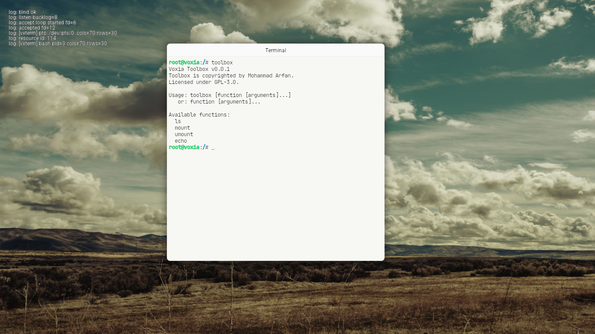

# 🌌 Voxia OS

A Simple modular x86_64 kernel designed with simplicity and elegance in mind.

[](https://www.codefactor.io/repository/github/marfanr/voxia)



---

## ✨ Features

- 🚀 **Symmetric Multiprocessing (SMP):** Native support for multi-core processors.
- 📂 **VFS:** A flexible Virtual File System with integrated caching and RCU support.
- 🔌 **Voxmo Driver Model:** Modular driver architecture for seamless hardware extensions.
- 🌐 **Networking:** Built-in network stack with support for E1000.
- 🛠️ **Kconfig Integration:** Highly configurable build system using industry standards.
- 🚢 **Modern Booting:** Seamless UEFI and BIOS support via the Limine bootloader.

## 🛠️ Prerequisites

Before building Voxia, ensure you have the following tools installed on your system:

- **Compiler:** `clang`, `nasm`
- **Build Tools:** `make`, `curl`, `7z` (p7zip)
- **ISO Tools:** `xorriso`
- **Emulator:** `qemu-system-x86_64`
- **Configuration:** `kconfig-frontends` (for `menuconfig` and `defconfig`)

## 🚀 Getting Started

### 1. Clone the Repository
```bash
git clone https://github.com/marfanr/voxia.git
cd voxia
```

### 2. Configure the Kernel
Initialize the default configuration or customize it to your needs:
```bash
make defconfig    # Load default configuration
make menuconfig   # Customize features (optional)
```

### 3. Build the ISO
This command downloads the Limine bootloader, compiles the kernel and modules, and packages them into a bootable ISO:
```bash
make iso
```

### 4. Run in QEMU
Launch Voxia in a virtualized environment with a single command:
```bash
make run
```

## Star History

[](https://www.star-history.com/?repos=marfanr%2Fvoxia&type=date&legend=top-left)

## 📜 License
Voxia is licensed under the [GNU General Public License v3.0](LICENSE).

---
Developed with ❤️ by [marfanr](https://github.com/marfanr)
